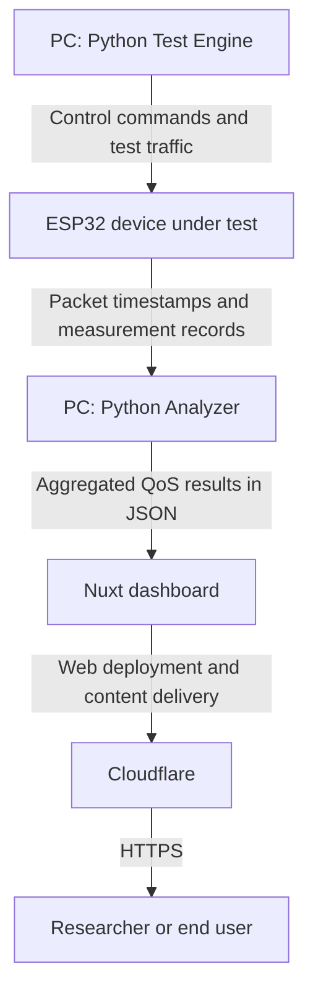

# ESPy-Nexus

ESPy-Nexus is a Hardware-in-the-Loop (HIL) research platform developed as part of a master's thesis at Cracow University of Technology.
The project is used to evaluate communication performance in embedded systems by combining a real ESP32 device under test with automated measurement software and a web-based analytical interface.

## System Components

- **ESP32 firmware** - runs the device under test, receives control commands, processes selected communication protocols, timestamps received packets, and stores measurement records in PSRAM.
- **Python Test Engine** - creates and executes test scenarios, generates traffic, communicates with the ESP32, and stores raw measurements in SQLite.
- **Python Analyzer** - transforms raw measurements into QoS metrics, including Packet Delivery Ratio (PDR), jitter, burst loss, goodput, out-of-order events, and relative delay.
- **Nuxt dashboard** - presents aggregated results through interactive filtering, comparison, tables, and charts.

## Data Flow

## Online Dashboard

[Open the ESPy-Nexus dashboard](https://espy-nexus.niewiaro.cc/en)
